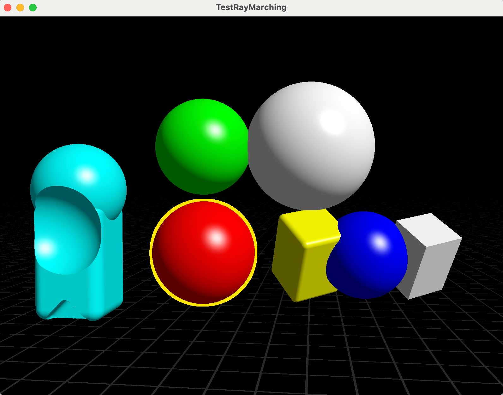
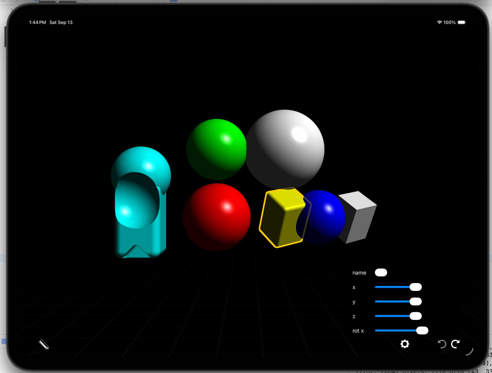
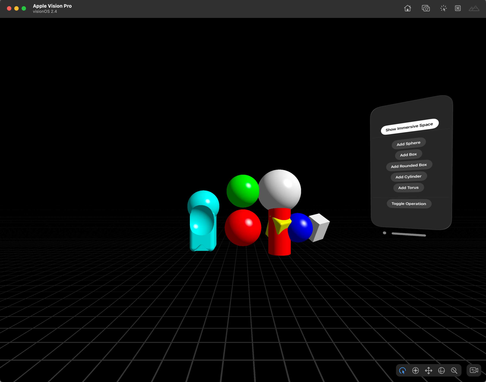

# Prototype of realtime 3D SDF rendering and editing

- works on macOS, iOS, iPadOS and visionOS

MacOS:

iPadOS:

visionOS:

# Implementation details
- SDF evaluation written in C++. Runs both on CPU (for picking) and GPU with Metal Shading Language (rendering)
- Optimized for realtime rendering (partitioning, culling, C++ template meta programming)

# Instructions

- drag objects to move them
- camera controls: double tap on object to frame it, double tap on empty space to frame all, pan one finger  to orbit, pinch to zoom in/out, pan with two fingers to pan camera
